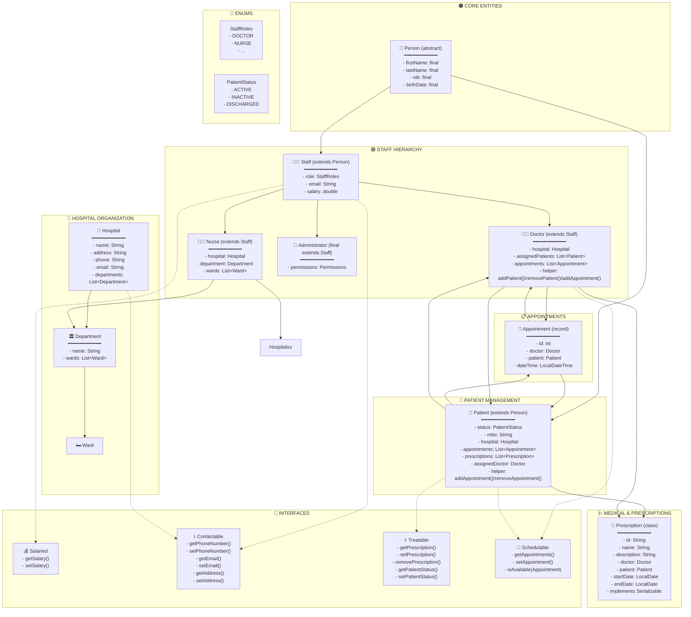

```mermaid
graph TD
    subgraph Interfaces["🔵 INTERFACES"]
        Salaried["💰 Salaried<br/>- getSalary()<br/>- setSalary()"]
        Contactable["📞 Contactable<br/>- getPhoneNumber()<br/>- setPhoneNumber()<br/>- getEmail()<br/>- setEmail()<br/>- getAddress()<br/>- setAddress()"]
        Treatable["⚕️ Treatable<br/>- getPrescription()<br/>- setPrescription()<br/>- removePrescription()<br/>- getPatientStatus()<br/>- setPatientStatus()"]
        Schedulable["📅 Schedulable<br/>- getAppointments()<br/>- setAppointment()<br/>- isAvailable(Appointment)"]
    end

    subgraph Core["🟠 CORE ENTITIES"]
        Person["👤 Person (abstract)<br/>━━━━━━━━━━━<br/>- firstName: final<br/>- lastName: final<br/>- oib: final<br/>- birthDate: final"]
    end

    subgraph Staff["🟢 STAFF HIERARCHY"]
        StaffClass["👨‍💼 Staff (extends Person)<br/>━━━━━━━━━━━<br/>- role: StaffRoles<br/>- email: String<br/>- salary: double"]
        Doctor["👨‍⚕️ Doctor (extends Staff)<br/>━━━━━━━━━━━<br/>- hospital: Hospital<br/>- assignedPatients: List&lt;Patient&gt;<br/>- appointments: List&lt;Appointment&gt;<br/>- helper: addPatient()/removePatient()/addAppointment()"]
        Nurse["👩‍⚕️ Nurse (extends Staff)<br/>━━━━━━━━━━━<br/>- hospital: Hospital<br/>- department: Department<br/>- wards: List&lt;Ward&gt;"]
        Administrator["🔐 Administrator (final extends Staff)<br/>━━━━━━━━━━━<br/>- permissions: Permissions"]
    end

    subgraph Patients["🔴 PATIENT MANAGEMENT"]
        PatientClass["🏥 Patient (extends Person)<br/>━━━━━━━━━━━<br/>- status: PatientStatus<br/>- mbo: String<br/>- hospital: Hospital<br/>- appointments: List&lt;Appointment&gt;<br/>- prescriptions: List&lt;Prescription&gt;<br/>- assignedDoctor: Doctor<br/>- helper: addAppointment()/removeAppointment()"]
    end

    subgraph Appointments["📋 APPOINTMENTS"]
        Appointment["📅 Appointment (record)<br/>━━━━━━━━━━━<br/>- id: int<br/>- doctor: Doctor<br/>- patient: Patient<br/>- dateTime: LocalDateTime"]
    end

    subgraph Medical["🩺 MEDICAL & PRESCRIPTIONS"]
        PrescriptionNode["💊 Prescription (class)<br/>━━━━━━━━━━━<br/>- id: String<br/>- name: String<br/>- description: String<br/>- doctor: Doctor<br/>- patient: Patient<br/>- startDate: LocalDate<br/>- endDate: LocalDate<br/>- implements Serializable"]
    end

    subgraph Organization["🏢 HOSPITAL ORGANIZATION"]
        Hospital["🏥 Hospital<br/>━━━━━━━━━━━<br/>- name: String<br/>- address: String<br/>- phone: String<br/>- email: String<br/>- departments: List&lt;Department&gt;"]
        Department["🏛 Department<br/>━━━━━━━━━━━<br/>- name: String<br/>- wards: List&lt;Ward&gt;"]
        Ward["🛏️ Ward"]
    end

    subgraph Enums["🔵 ENUMS"]
        StaffRoles["StaffRoles<br/>- DOCTOR<br/>- NURSE<br/>- ..."]
        PatientStatus["PatientStatus<br/>- ACTIVE<br/>- INACTIVE<br/>- DISCHARGED"]
    end

%% Inheritance
    Person --> StaffClass
    Person --> PatientClass
    StaffClass --> Doctor
    StaffClass --> Nurse
    StaffClass --> Administrator
%% Interface implementations
    StaffClass -.-> Salaried
    StaffClass -.-> Contactable
    Doctor -.-> Schedulable
    PatientClass -.-> Schedulable
    PatientClass -.-> Treatable
    Hospital -.-> Contactable
%% Associations
    Doctor --> Appointment
    PatientClass --> Appointment
    Appointment --> Doctor
    Appointment --> PatientClass
    Doctor --> PatientClass
    PatientClass --> Doctor
    PatientClass --> PrescriptionNode
    Doctor --> PrescriptionNode
    Hospital --> Department
    Department --> Ward
    Nurse --> Department
    Nurse --> Hospitalss
```